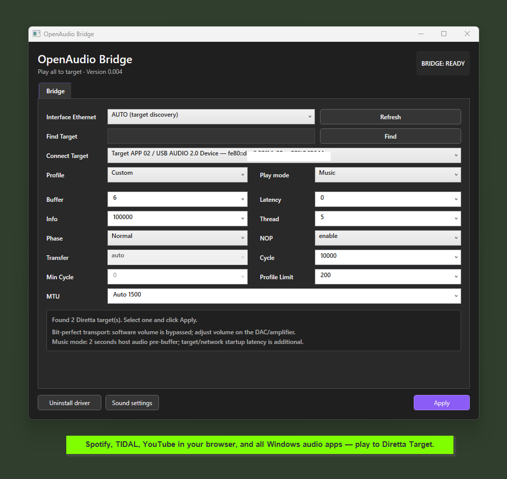

# OpenAudio Bridge

**Binary beta for personal research — version 0.004**

## Download

Download the beta package from [OpenAudioBridge-v0.004-test.zip](https://github.com/lyriano/openaudio/releases/download/v0.004-beta/OpenAudioBridge-v0.004-test.zip).
Verify the ZIP against the matching SHA-256 checksum attached to the release
before extracting.

Always extract the complete ZIP; do not run only a file from `app\`.



OpenAudio Bridge is a Windows audio bridge that routes audio from normal
Windows applications to a Diretta Target through the Diretta Host SDK path.
It is designed for private listening experiments and qualification, not as a
commercial product.

> This repository contains release binaries only. It intentionally does not
> contain OpenAudio Bridge source code, Diretta SDK headers/libraries, private
> signing keys, or developer build files.

## What it does

The beta exposes an **OpenAudio Bridge** Windows playback endpoint. Applications
such as Spotify, TIDAL, YouTube in a browser, Foobar2000, and other WASAPI
applications can select that endpoint. The audio path is:

```text
Windows audio application
        -> OpenAudio Bridge audio endpoint
        -> OpenAudio Gateway
        -> Diretta Host SDK 1.49.x
        -> Diretta Target
```

The gateway uses the Diretta SDK directly. A Diretta ASIO Host driver is not
required for this route, although another Diretta host path can still be kept
installed for separate experiments. Do not route the same application through
two host paths at the same time.

## Why test it

- One target route for common Windows music applications.
- Target discovery with the DAC/sink name and IP address visible in the
  connection selector.
- `Music` and experimental `Video` modes.
- PCM16/24/32 source support where the Windows endpoint and target accept it;
  the gateway does not deliberately force every source to PCM16. A fallback
  can occur when the selected target rejects the source wire format.
- Configurable audio buffering modes for controlled listening tests.
- **Bit-perfect priority:** the bridge applies no software volume processing or
  sample attenuation. Adjust listening level at the DAC or amplifier.

## Beta status and important limits

This is an internal qualification beta. The package is **test-signed**, not
Microsoft production-signed, and its manifest intentionally reports
`distribution_ready=false`. The driver therefore requires Windows Test Mode
and may require Secure Boot to be disabled according to the local Windows
policy. Test Mode reduces driver-signing protection; use it only on a machine
you control.

Audio playback currently uses an intentional **approximately 3–4 second
pre-buffer** before sound begins. This startup delay is part of the current
qualification design; target/network/DAC startup time is additional.

`Video` mode is experimental and is intended to improve video/audio timing
alignment. Current beta builds can still have an audio/video timing offset, so
automatic lip-sync is not guaranteed. Continuous playback is also not
guaranteed on every network/target combination.

The package is not a replacement for a Microsoft-signed production driver and
is not a claim of Diretta certification. It is a personal research build.

## Installation (Windows x64)

### ⚠️ IMPORTANT: Secure Boot

**This test-signed beta may not load while Secure Boot is enabled.** If Windows
blocks the driver, enter the computer's **BIOS/UEFI settings**, disable
**Secure Boot**, save the change, and restart Windows. Turn Secure Boot on
again after removing the beta driver.

1. Download and extract the complete ZIP to a local folder. The extracted
   folder is only the installer package; do not treat it as the installed
   application.
2. If Windows says that the test driver cannot be loaded, restart the computer
   into its BIOS/UEFI settings, turn off **Secure Boot**, save the change, and
   restart Windows. The menu name varies by computer. Use this beta only on a
   test machine, and turn Secure Boot on again after removing the beta driver.
3. Right-click **Enable OpenAudio Bridge Test Mode.bat** and choose **Run as
   administrator**. Confirm `Y`. Restart Windows when prompted by the script.
   If Test Mode is already enabled, this step can be skipped.
4. After Windows restarts, right-click **Install OpenAudio Bridge.exe** and
   choose **Run as administrator**. The installer copies the application to
   `%ProgramFiles%\OpenAudio\Bridge`, registers the driver and Gateway service,
   and creates **OpenAudio Bridge** shortcuts in the Windows Start menu and on
   the desktop. The installer does not restart Windows by itself.
5. Launch **OpenAudio Bridge** from the Windows Start menu or its desktop
   shortcut. Do not launch `OpenAudioBridgeControl.exe` from the extracted ZIP;
   that copy is only the installer source. If a shortcut was not created, use
   the installed copy at `%ProgramFiles%\OpenAudio\Bridge\OpenAudioBridgeControl.exe`.
6. Select the Ethernet interface, select the intended target, choose `Music`
   or experimental `Video`, and click **Apply**.
7. In Windows Sound settings, select **Speakers (OpenAudio Bridge)** as the
   output for the application being tested.

## After restarting Windows

The installation is per-machine and persistent. After the required restart,
do **not** run the installer or the Test Mode script again on every boot.
Open **OpenAudio Bridge** from the Start menu or desktop shortcut, then select
**Speakers (OpenAudio Bridge)** in Windows Sound settings. The Gateway service
and driver remain installed and Windows starts them when needed.

If the OpenAudio speaker is missing after a reboot, run **Enable OpenAudio
Bridge Test Mode.bat** as administrator and restart Windows. If it is still
missing, Secure Boot may have been enabled again; **disable Secure Boot in the
computer's BIOS/UEFI settings as described above**, then restart. Reinstalling
the package is normally not needed.

The connection selector uses a generated `Target APP 01`, `Target APP 02`, …
identity for the current discovery snapshot, followed by the DAC/sink name and
IP when available.

## Uninstall / leave Test Mode

Use **Uninstall OpenAudio Bridge.exe** as administrator. After testing, run
**Disable OpenAudio Bridge Test Mode.bat** as administrator and restart Windows
again. The package never silently changes Test Mode or reboots the machine.

## Diretta SDK and personal-use terms

OpenAudio Bridge was built and tested against a locally supplied Diretta Host
SDK 1.49.x under permission for personal research. The SDK itself is not
redistributed in this repository or in the ZIP. Each user is responsible for
having their own right to use the Diretta SDK and for complying with Diretta's
license and SDK terms. Do not extract, copy, or redistribute Diretta SDK files
from a development installation.

This beta is offered for **personal, non-commercial research and testing**.
It is not sold, licensed as a commercial product, or supported as a production
audio driver. See [`BETA_TERMS.md`](BETA_TERMS.md) for the complete beta notice.

## Disclaimer

Use at your own risk. The software is provided for testing **without warranty
of any kind**, including reliability, compatibility, availability, audio
quality, data integrity, or fitness for a particular purpose. The author is
not responsible for driver problems, Windows policy changes, loss of audio,
device configuration changes, network faults, hearing damage, or any other
direct or indirect loss. Keep backups and test at a safe listening level.

## Repository policy

This is a binary-only beta staging repository. No source code or SDK payload is
intended to be published here. Release artifacts are test-signed and protected
for internal qualification; production distribution requires a separate
Microsoft-signed driver catalog, production Authenticode certificates, and a
new qualification gate.
